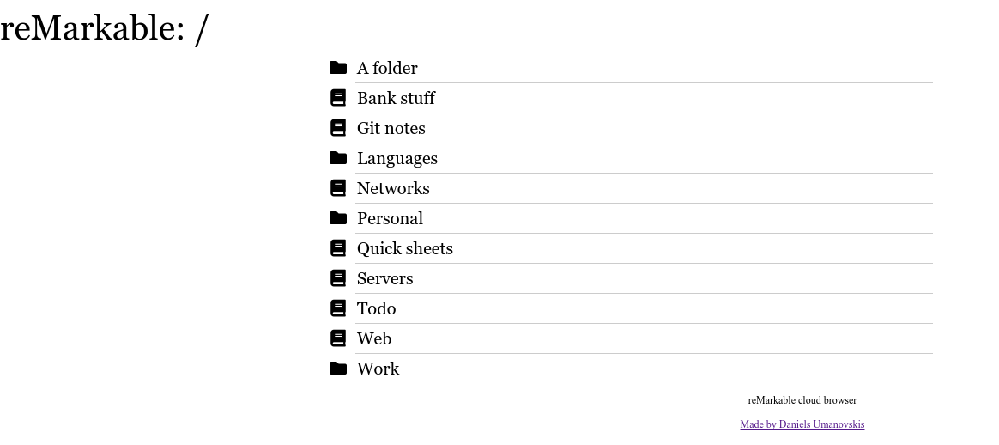

# reMarkable cloud browser

This is a Web interface to browse reMarkable tablet files stored in the cloud. The app relies on [rmapi](https://github.com/juruen/rmapi).

You can click on individual notebooks to download them, and you should then get a PDF of that notebook. There is no template background however.

This isn't a mature or serious project - it's a weekend hack for me to learn the basics of Go and serving Web pages, but the project can be useful nonetheless.

# Building and running

First you need `rmapi`:

```
go get -u github.com/juruen/rmapi
```

Then you can clone the repository and build with `go build`. Run the resulting binary to get the Web interface, by default it binds to port `8080` on the local machine, so [http://localhost:8080](http://localhost:8080) should work.

If the machine you're running on doesn't have a reMarkable authorization key, then the binary will prompt for it in the terminal - that functionality is handled by `rmapi`.

If you get this package with `go get`, the automatically built binary won't work because it doesn't have static files embedded.

# Screenshot


